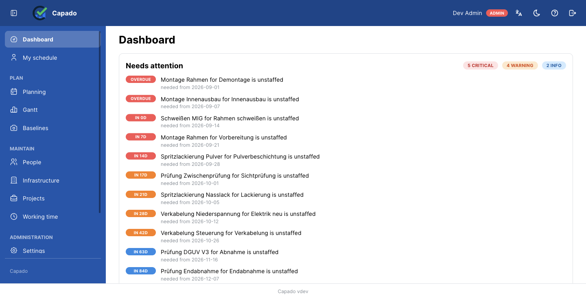
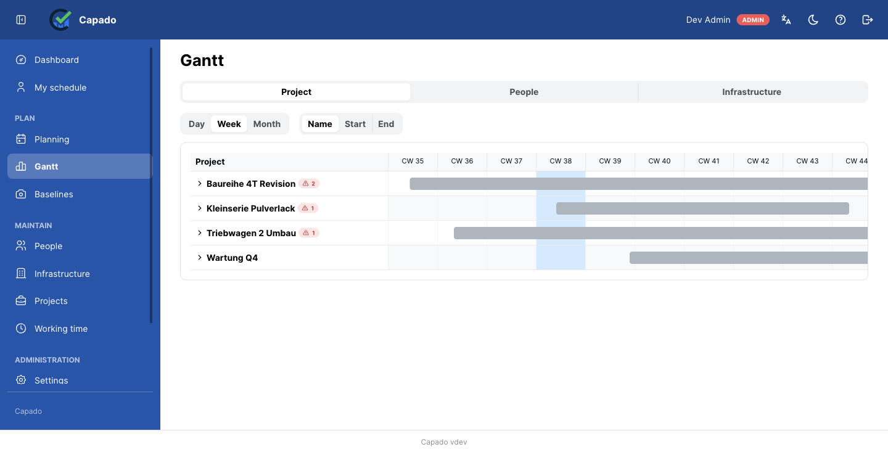
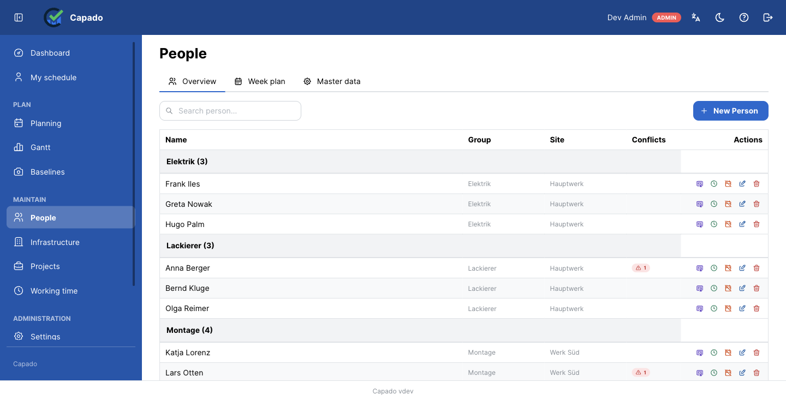

# Capado

*Capacity Done.*

[](https://www.gnu.org/licenses/gpl-3.0)

[Deutsch](README.md) · **English**

---

## The problem Capado solves

On a shop floor the same people and the same machines compete for the same hours. Who works on which
order, and when, also depends on who is *allowed* to — welding certification, crane licence, forklift
permit, each with an expiry date.

Almost everywhere this planning lives in a spreadsheet. That works until three things happen at once:
somebody double-books a person without noticing; a certificate lapses in the middle of a job; and
nobody can reconstruct what the plan looked like last month when it was reported on.

Capado is built for exactly that point. It plans people **and** equipment in one model, checks
qualifications against the time the work is scheduled for, and reports over-allocation the moment it
appears.

## Who it is for

Small and mid-sized manufacturing, maintenance and workshop operations that plan orders across weeks
and months, whose work depends on qualifications, and who want — or are required — to keep their data
in-house.

Explicitly **not** a time-tracking system. Capado plans what is intended; it does not record what was
actually worked ([ADR-009](docs/decisions/009-no-actual-time-recording.md)). That is a deliberate
boundary, and it also simplifies works-council co-determination considerably.

## What it does differently

**People and machines in one model.** A person can be booked at 50%; a workstation is either occupied
or free. Both shapes live in one conflict detector rather than in two tools that know nothing about
each other.

**Working time is taken seriously.** Capacity comes from three layers: a week profile with minutes per
weekday, the site's holidays and exceptions, and absences. A half day on 24 December, a designated
working Saturday and a plant shutdown are all expressible — and part-time belongs in the week profile,
not in an absence.

**Qualifications are checked against the work, not against today.** A certificate expiring in March
does not cover a job in April. If it lapses mid-job, the requirement counts as unmet for that job —
not half met.

**Conflicts appear on save.** No nightly batch, no "we'll see tomorrow". Whoever over-allocates finds
out immediately, with a severity and suggestions for resolving it.

**Traceability is built in.** A change log, recorded baselines to compare against, and a planning
freeze that stops a reported period from changing retroactively.

**It does not phone home.** No telemetry, no analytics, no account with us. The only outbound
connections are the ones you configure yourself: your mail server and, if you want it, your OIDC
provider.

## What it looks like

The screenshots show a demo instance with **invented data** — names, sites and vehicle designations
bear no relation to any real operation.

**The dashboard leads with what needs attention**, ordered by urgency rather than being a start menu:
what is expiring, which commitment is uncovered, which requirement nobody staffs.



**The Gantt shows conflicts as colour.** A project bar is grey, because a project is a container and
occupies no resource; a work package is blue, and red means there is a conflict. A collapsed project
row carries the number of conflicts it is affected by.



**People and machines live in one model** without being called the same thing. The conflict column
shows, per person, where the plan does not work.



## Scope

| Area | Included |
|------|----------|
| Planning | Projects in a folder hierarchy, work packages, assignments for people and equipment, Gantt, team week |
| Capacity | Week profiles, per-site holidays and exceptions, absences, utilization per person per week |
| Conflicts | Detection on write, severity, resolution suggestions, unmet requirements |
| Qualification | Skills with attributes and levels 1–5, validity windows, skill mismatches, expiry warnings |
| Scheduling | Lead time in working days, dependencies with lag, float and critical path, customer commitments |
| Traceability | Change log, baselines with comparison, planning freeze |
| Reporting | Excel reports for utilization and project status, an action list by mail |
| Operations | Roles with scope limits, OIDC sign-in, UI and help in German and English |

## Quick start

Prerequisite: Docker.

```bash
curl -O https://raw.githubusercontent.com/Tyron2k/Capado/main/docker-compose.prod.yml
curl -o .env https://raw.githubusercontent.com/Tyron2k/Capado/main/.env.example

# Two values are mandatory — the backend refuses to start without them:
#   POSTGRES_PASSWORD   any strong password
#   JWT_SECRET_KEY      openssl rand -hex 32
# Trying it on plain HTTP at localhost? Also set COOKIE_SECURE=false, or you
# will be logged out on every page load.

docker compose -f docker-compose.prod.yml up -d
```

This pulls the published images; nothing is compiled. Open http://localhost:3000 — the setup page
guides you through creating the first admin account. Migrations run automatically on start.

Only port 3000 needs to be reachable: the frontend serves the app and proxies `/api/` onward.
Postgres is deliberately not published to the host.

Pin a version rather than running `latest` for anything you depend on — set `CAPADO_VERSION=<version>` in
`.env`. See [upgrading](docs/how-to/upgrading.md).

## Running from source

```bash
git clone git@github.com:Tyron2k/Capado.git
cd Capado
cp .env.example .env          # set POSTGRES_PASSWORD
docker volume create capado_postgres_data
docker compose up -d
```

`docker-compose.yml` builds the dev targets and bind-mounts the source, so both services hot reload on
change. It uses a different database from `docker-compose.prod.yml`, so the two cannot write over each
other.

## Architecture

```
frontend (React/Vite :3000) → backend (FastAPI :3001) → PostgreSQL
```

Three containers. In detail in [architecture.md](docs/explanation/architecture.md), which maps every
feature area to the file its rules live in.

## Documentation

| Audience | Where |
|----------|-------|
| Users | In the app under `/help` — 29 topics in German and English |
| Operators | [Upgrading](docs/how-to/upgrading.md) · [Known limitations](docs/reference/known-limitations.md) · [.env.example](.env.example) |
| Works council, data protection | [Purpose and boundaries](docs/compliance/zweck-und-grenzen-de.md) — in German, with the full list of personal data processed |
| Developers | [docs/](docs/README.md) — English, organised by [Diátaxis](https://diataxis.fr/) |

## Languages in this project

German is the primary language for everything users and operators read: the UI, the help, compliance
documents, the main README. English is the language of the code — identifiers, comments, docstrings,
commit messages — and of the developer documentation. Details in [CONTRIBUTING.md](CONTRIBUTING.md).

This file is a translation of [README.md](README.md), which is authoritative if the two ever disagree.

## License

Copyright (C) 2026 Tino Pittner

Capado is free software under the [GNU General Public License v3](LICENSE) or, at your option, any
later version. It is distributed in the hope that it will be useful, but **without any warranty** —
without even the implied warranty of merchantability or fitness for a particular purpose.

**Running Capado inside your own organisation carries no obligations whatsoever.** The GPL's
requirements attach to *distribution* — passing the software or a modified version on to somebody
else. Deploying it for your own staff is not distribution, so you can modify it freely and never
publish anything. If you do hand a modified version to a third party, they get the source under the
same licence.

Capado is **not for sale**. If you want to support the work, GitHub Sponsors is the way.

## Contributing

See [CONTRIBUTING.md](CONTRIBUTING.md). Contributions are licensed under the GPL-3.0 like the rest of
the project — there is no agreement to sign.
