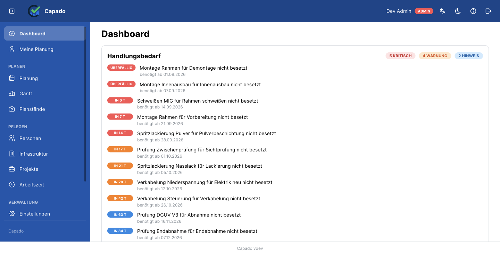
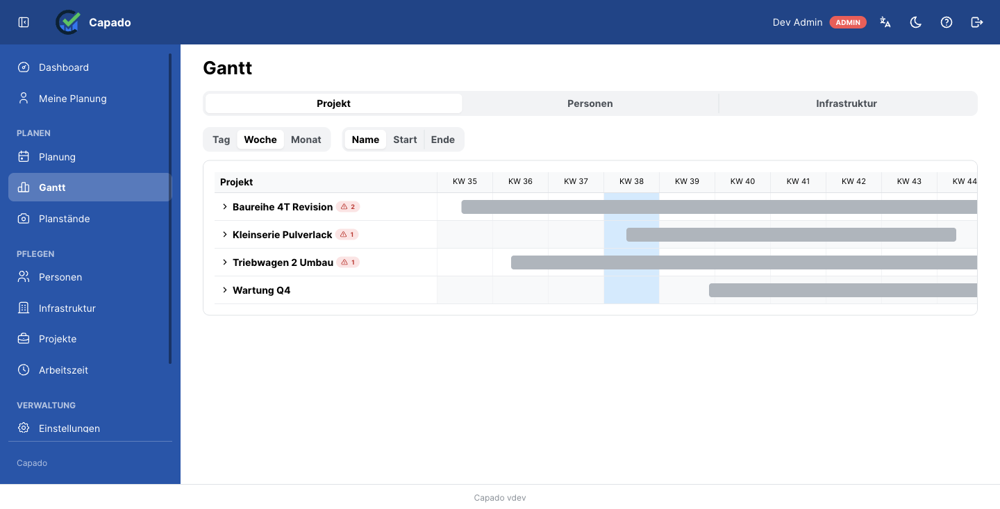
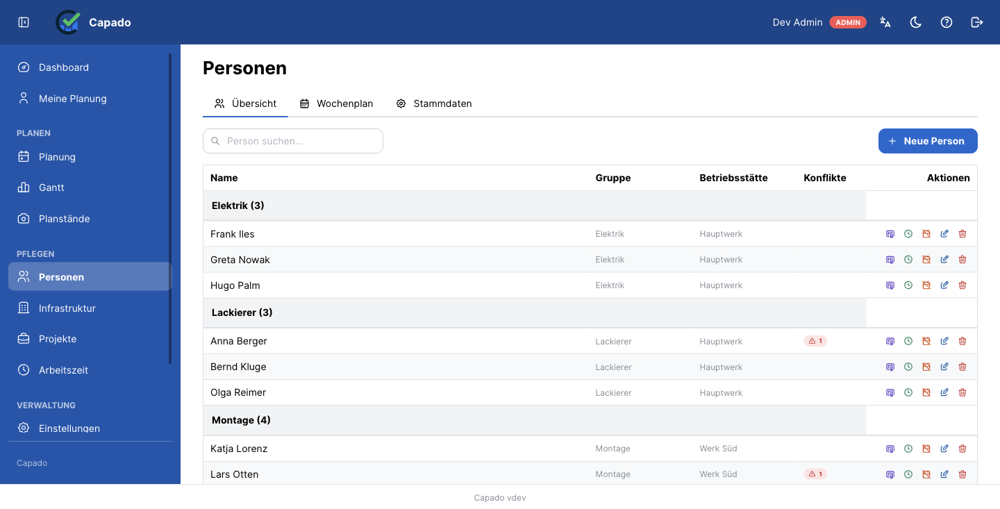

# Capado

*Capacity Done.*

[](https://www.gnu.org/licenses/gpl-3.0)

**Deutsch** · [English](README.en.md) — *Capacity planning for people and machines. Self-hosted.*

---

## Was Capado löst

In einer Fertigung oder Werkstatt konkurrieren dieselben Leute und dieselben Maschinen um dieselbe
Zeit. Wer wann an welchem Auftrag arbeitet, hängt zusätzlich daran, wer es **darf** — Schweißprüfung,
Kranschein, Staplerausweis, jeweils mit Ablaufdatum.

Diese Planung lebt fast überall in einer Tabellenkalkulation. Die funktioniert, bis drei Dinge
gleichzeitig passieren: jemand überbucht eine Person, ohne es zu merken; ein Nachweis läuft mitten im
Auftrag ab; und niemand kann mehr sagen, wie der Plan letzten Monat aussah, als er berichtet wurde.

Capado ist für genau diesen Punkt gebaut. Es plant Personal **und** Betriebsmittel in einem Modell,
prüft Qualifikationen gegen den Zeitpunkt der Arbeit und meldet Überlast in dem Moment, in dem sie
entsteht.

## Für wen

Fertigungs-, Instandhaltungs- und Werkstattbetriebe im Mittelstand, die Aufträge über Wochen und
Monate planen, deren Arbeit an Qualifikationen hängt und die ihre Daten im eigenen Haus behalten
wollen oder müssen.

Ausdrücklich **nicht** gedacht als Zeiterfassung. Capado plant, was vorgesehen ist; es erfasst nicht,
was tatsächlich gearbeitet wurde ([ADR-009](docs/decisions/009-no-actual-time-recording.md)) — eine
bewusste Grenze, die auch die Mitbestimmung erheblich vereinfacht.

## Was es anders macht

**Menschen und Maschinen in einem Modell.** Eine Person kann zu 50 % eingeplant sein, ein
Arbeitsplatz ist zu 100 % belegt oder frei. Beide Formen leben in einer Konflikterkennung, statt in
zwei Werkzeugen, die nichts voneinander wissen.

**Arbeitszeit wird ernst genommen.** Kapazität entsteht aus drei Schichten: einem Wochenprofil mit
Minuten je Wochentag, den Feiertagen und Ausnahmen des Standorts, und den Abwesenheiten. Ein halber
Tag am 24. Dezember, ein angesetzter Arbeitssamstag und Werksferien sind alle abbildbar — und Teilzeit
gehört ins Wochenprofil, nicht in eine Abwesenheit.

**Qualifikationen werden gegen die Arbeit geprüft, nicht gegen heute.** Ein Nachweis, der im März
abläuft, deckt keinen Auftrag im April. Läuft er mitten im Auftrag ab, gilt die Anforderung für diesen
Auftrag als nicht erfüllt — nicht zur Hälfte.

**Konflikte entstehen beim Speichern.** Keine Nachtläufe, kein „morgen sehen wir's". Wer überbucht,
erfährt es sofort, mit Schweregrad und Vorschlägen zur Auflösung.

**Nachvollziehbarkeit ist eingebaut.** Ein Änderungsprotokoll, festgehaltene Planstände zum Vergleich
und eine Planungssperre, die verhindert, dass sich ein berichteter Zeitraum rückwirkend ändert.

**Es telefoniert nicht nach Hause.** Keine Telemetrie, keine Analytics, kein Konto bei uns. Die
einzigen ausgehenden Verbindungen sind die, die du selbst einträgst: dein Mailserver und, wenn du
willst, dein OIDC-Anbieter.

## Wie es aussieht

Die Bilder zeigen eine Demo-Instanz mit **erfundenen Daten** — Namen, Betriebe und Fahrzeug­bezeichnungen
haben keinen Bezug zu einem echten Betrieb.

**Das Dashboard führt mit dem Handlungsbedarf**, nach Dringlichkeit sortiert, statt mit einem Startmenü:
was läuft ab, welche Zusage ist ungedeckt, welche Anforderung ist unbesetzt.



**Der Gantt zeigt Konflikte als Farbe.** Ein Projektbalken ist grau, weil ein Projekt ein Behälter ist
und keine Ressource belegt; ein Arbeitspaket ist blau, und rot heißt: hier ist ein Konflikt. Eine
eingeklappte Projektzeile trägt die Zahl der Konflikte, von denen sie betroffen ist.



**Menschen und Maschinen liegen in einem Modell**, aber sie heißen nicht gleich: Personen sind Personen,
Infrastruktur ist Infrastruktur. Die Konfliktspalte zeigt pro Person, wo es klemmt.



## Funktionsumfang

| Bereich | Enthalten |
|---------|-----------|
| Planung | Projekte in Ordnerhierarchie, Arbeitspakete, Zuweisungen für Personal und Betriebsmittel, Gantt, Wochenplan des Teams |
| Kapazität | Wochenprofile, Feiertage und Ausnahmen je Standort, Abwesenheiten, Auslastung je Person und Woche |
| Konflikte | Erkennung beim Schreiben, Schweregrad, Auflösungsvorschläge, offene Anforderungen |
| Qualifikation | Skills mit Attributen und Stufen 1–5, Gültigkeitszeiträume, Skill-Abweichungen, Ablaufwarnungen |
| Termine | Durchlaufzeit in Arbeitstagen, Abhängigkeiten mit Wartezeit, Puffer und kritischer Pfad, Kundentermine |
| Nachvollziehbarkeit | Änderungsprotokoll, Planstände mit Vergleich, Planungssperre |
| Auswertung | Excel-Berichte zu Auslastung und Projektstatus, Handlungsbedarf per Mail |
| Betrieb | Rollen mit Bereichsgrenzen, OIDC-Anmeldung, Oberfläche und Hilfe auf Deutsch und Englisch |

## Schnellstart

Voraussetzung: Docker.

```bash
curl -O https://raw.githubusercontent.com/Tyron2k/Capado/main/docker-compose.prod.yml
curl -o .env https://raw.githubusercontent.com/Tyron2k/Capado/main/.env.example

# Zwei Werte sind Pflicht — ohne sie startet das Backend nicht:
#   POSTGRES_PASSWORD   ein starkes Passwort
#   JWT_SECRET_KEY      openssl rand -hex 32
# Test über einfaches HTTP auf localhost? Dann zusätzlich COOKIE_SECURE=false,
# sonst wirst du bei jedem Seitenaufruf abgemeldet.

docker compose -f docker-compose.prod.yml up -d
```

Das zieht die veröffentlichten Images, es wird nichts kompiliert. Öffne http://localhost:3000 — die
Einrichtungsseite führt durch das Anlegen des ersten Administrators. Migrationen laufen beim Start
automatisch.

Nur Port 3000 muss erreichbar sein: das Frontend liefert die Anwendung aus und leitet `/api/` intern
weiter. Postgres wird bewusst nicht auf den Host veröffentlicht.

Für alles, worauf du dich verlässt, eine Version festnageln statt `latest` — `CAPADO_VERSION=<Version>`
in der `.env`. Siehe [Aktualisieren](docs/how-to/upgrading.md).

## Aus dem Quellcode

```bash
git clone git@github.com:Tyron2k/Capado.git
cd Capado
cp .env.example .env          # POSTGRES_PASSWORD setzen
docker volume create capado_postgres_data
docker compose up -d
```

`docker-compose.yml` baut die Entwicklungsziele und bindet den Quellcode ein, beide Dienste laden also
bei Änderungen neu. Es nutzt eine andere Datenbank als `docker-compose.prod.yml`, die zwei können sich
nicht überschreiben.

## Architektur

```
Frontend (React/Vite :3000) → Backend (FastAPI :3001) → PostgreSQL
```

Drei Container. Ausführlich in [architecture.md](docs/explanation/architecture.md), das jeden
Funktionsbereich auf die Datei abbildet, in der seine Regeln stehen.

## Dokumentation

| Für wen | Wo |
|---------|-----|
| Anwender | In der Anwendung unter `/help` — 29 Themen auf Deutsch und Englisch |
| Betreiber | [Aktualisieren](docs/how-to/upgrading.md) · [Bekannte Grenzen](docs/reference/known-limitations.md) · [.env.example](.env.example) |
| Betriebsrat, Datenschutz | [Zweck und Grenzen](docs/compliance/zweck-und-grenzen-de.md) — auf Deutsch, mit vollständiger Liste der verarbeiteten Personendaten |
| Entwickler | [docs/](docs/README.md) — englisch, nach [Diátaxis](https://diataxis.fr/) gegliedert |

## Sprachen im Projekt

Deutsch ist die Primärsprache für alles, was Anwender und Betriebe lesen: Oberfläche, Hilfe,
Compliance-Dokumente, dieses README. Englisch ist die Sprache des Codes — Bezeichner, Kommentare,
Docstrings, Commit-Nachrichten — und der Entwicklerdokumentation. Details in
[CONTRIBUTING.md](CONTRIBUTING.md).

## Lizenz

Copyright (C) 2026 Tino Pittner

Capado ist freie Software unter der [GNU General Public License v3](LICENSE) oder, nach deiner Wahl,
einer späteren Version. Es wird in der Hoffnung auf Nützlichkeit verbreitet, aber **ohne jede
Gewährleistung** — auch ohne die implizite Gewährleistung der Marktreife oder Eignung für einen
bestimmten Zweck.

**Der Betrieb im eigenen Haus bringt keinerlei Pflichten mit sich.** Die Anforderungen der GPL hängen
an der *Weitergabe* — daran, die Software oder eine geänderte Fassung an jemand anderen zu übergeben.
Sie für die eigene Belegschaft zu betreiben ist keine Weitergabe: du darfst beliebig ändern und musst
nie etwas veröffentlichen. Gibst du eine geänderte Fassung an Dritte, erhalten diese den Quellcode
unter derselben Lizenz.

Capado steht **nicht zum Verkauf**. Wer die Arbeit unterstützen will, kann das über GitHub Sponsors
tun.

## Mitmachen

Siehe [CONTRIBUTING.md](CONTRIBUTING.md). Beiträge stehen unter der GPL-3.0 wie das übrige Projekt —
es ist keine Vereinbarung zu unterschreiben.
